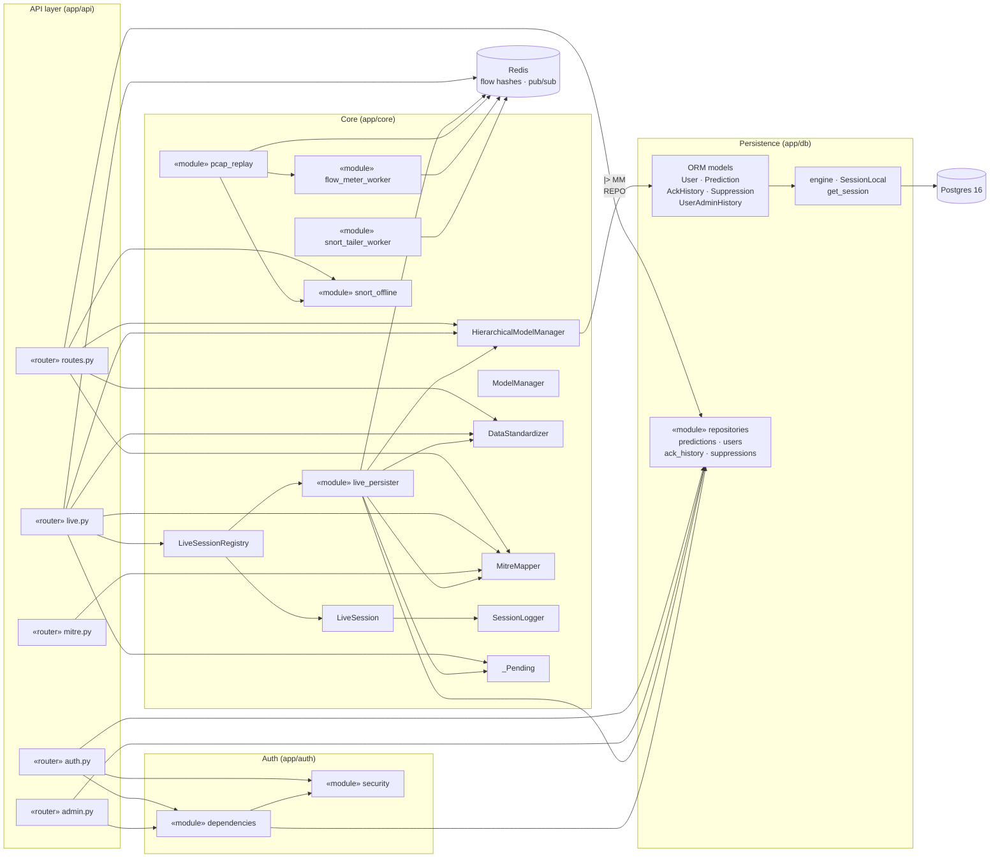
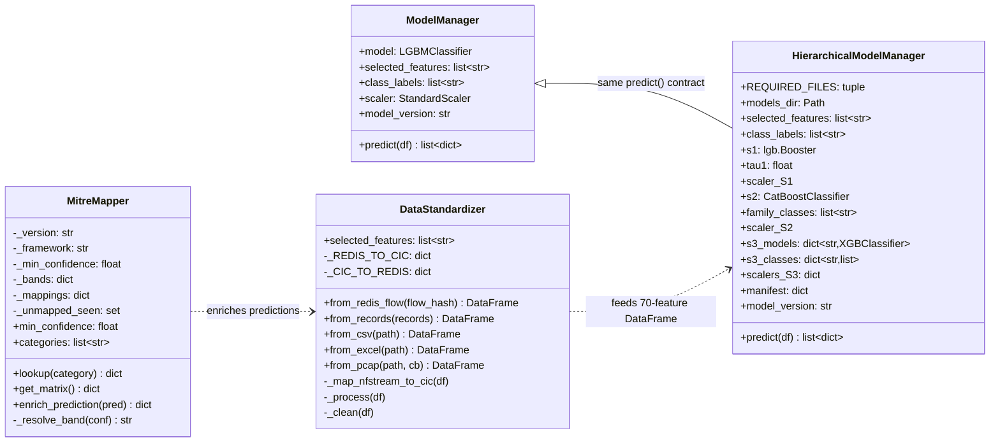
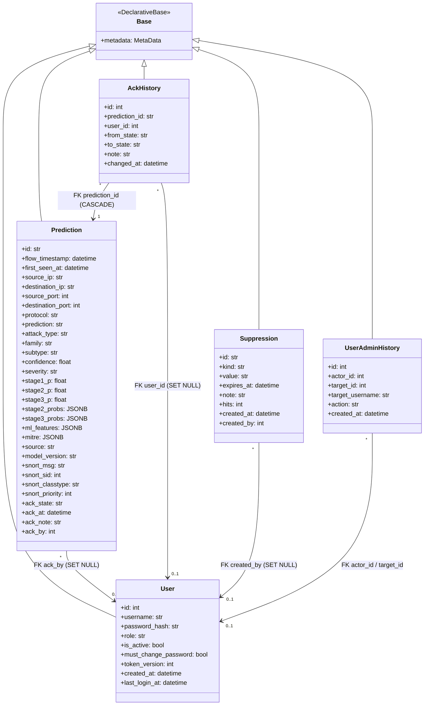
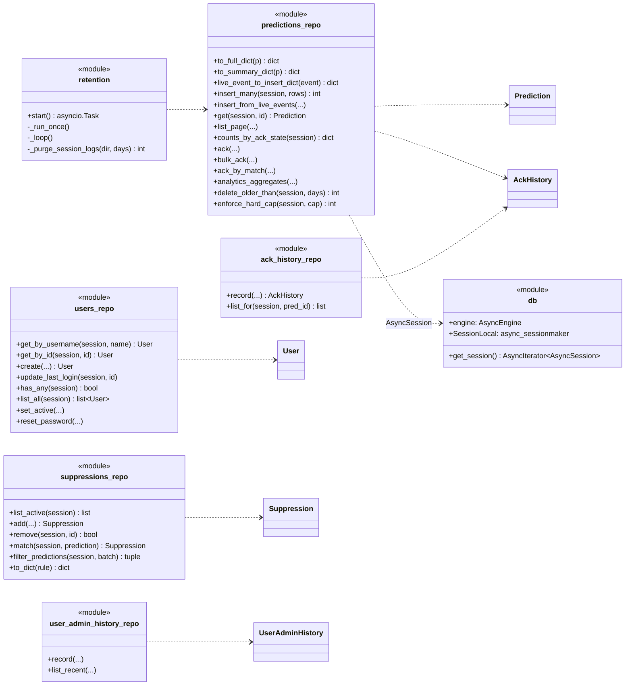
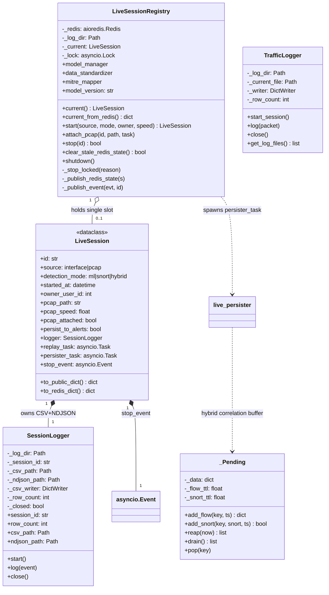
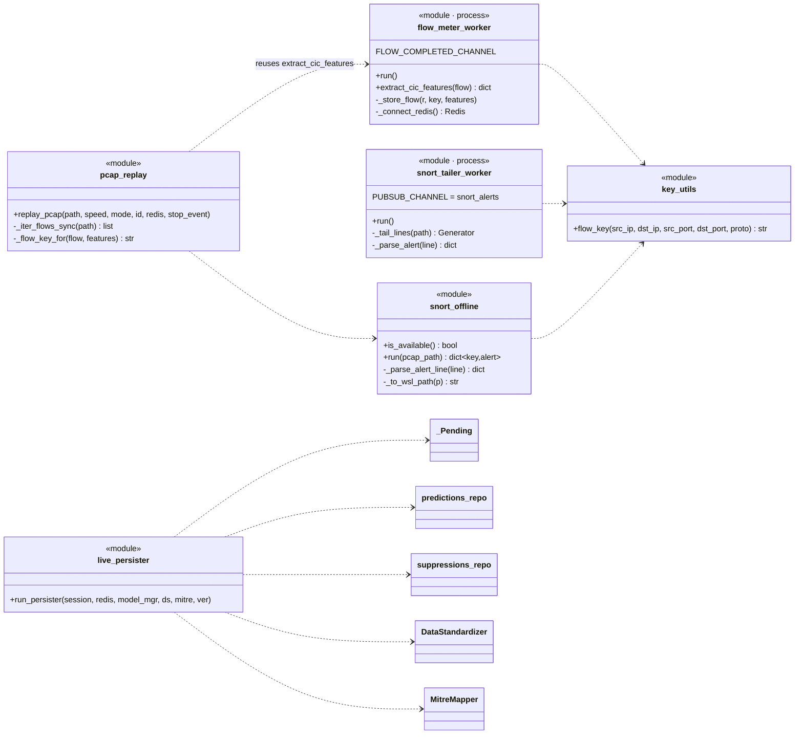

# H-IDS Backend — Class Diagram

A class-level model of the FastAPI backend (`app/`). It covers the four
sub-systems that make up the server side:

1. **Persistence** — SQLAlchemy ORM models + repository modules (Postgres).
2. **ML inference & enrichment** — the model managers, the feature
   standardizer, and the MITRE mapper.
3. **Live capture & session control plane** — the session registry, the
   per-session loggers, the hybrid correlation buffer, and the standalone
   workers / replay coroutines.
4. **Auth, schemas & app wiring** — security primitives, FastAPI
   dependencies, Pydantic request/response models, and the routers.

> True OOP classes are shown with full attributes/methods. Python modules
> that are collections of functions (workers, repositories, auth helpers,
> routers) are shown with the **«module»** / **«router»** stereotype and
> their key callables, because they are first-class architectural units even
> though they aren't `class` definitions.

---

## 1. Overview — sub-system dependencies



---

## 2. ML inference & enrichment



`ModelManager` and `HierarchicalModelManager` are **interchangeable** — they
share the `predict(df) -> list[dict]` contract, so `main.py` picks one at
startup (hierarchical when the four sentinels are on disk, legacy otherwise)
and the routes never care which is loaded.

---

## 3. Persistence — ORM models & repositories



### Repository modules (thin async functions over the ORM)



---

## 4. Live capture & session control plane



### Standalone workers, replay & persister (procedural modules)



---

## 5. Auth, API schemas & routers

```mermaid
classDiagram
    direction TB

    class security {
        <<module>>
        +SESSION_COOKIE_NAME
        +hash_password(plain) str
        +verify_password(plain, hash) bool
        +needs_rehash(hash) bool
        +create_session_token(user_id, role, ...) str
        +decode_session_token(token) dict
        +revocation_ttl_seconds(claims) int
    }

    class dependencies {
        <<module>>
        +get_current_user(request, cookie, session) User
        +require_admin(user) User
        -_jti_is_revoked(request, jti) bool
    }

    class LoginRequest { <<pydantic>> +username +password }
    class ChangePasswordRequest { <<pydantic>> +old_password +new_password }
    class CreateUserRequest { <<pydantic>> +username +password }
    class ResetPasswordRequest { <<pydantic>> +password }
    class SetActiveRequest { <<pydantic>> +is_active }
    class UserOut { <<pydantic>> +id +username +role +is_active }

    class AckRequest { <<pydantic>> +state +note }
    class BulkAckRequest { <<pydantic>> +ids +state +note }
    class SuppressionRequest { <<pydantic>> +kind +value +expires_at }
    class ManualFlowInput { <<pydantic>> +proto +sport +dsport +sbytes +... }
    class StartSessionRequest { <<pydantic>> +source +detection_mode +speed +persist_to_alerts }
    class LiveSessionOut { <<pydantic>> +session_id +source +detection_mode +row_count }

    dependencies ..> security : decode_session_token
    dependencies ..> users_repo : get_by_id
    dependencies ..> User
```



### Routers (FastAPI `APIRouter` modules)

```mermaid
classDiagram
    direction LR

    class routes {
        <<router>>
        GET /predictions
        GET /predictions/{id}
        POST /predictions/{id}/ack
        POST /predictions/ack/bulk
        POST /predictions/ack/by-match
        GET /analytics
        POST /analyze/upload
        POST /analyze/upload/stream
        POST /analyze/manual
        GET·POST /suppressions
    }
    class live {
        <<router>>
        GET /live/stream (SSE)
        GET·POST·DELETE /live/session
        POST /live/session/{id}/pcap
        GET /live/session/{id}/log
        -_sse_generator()
        -_build_event()
        -_run_ml()
        -_apply_mode_filter()
    }
    class auth_router {
        <<router>>
        POST /auth/login
        POST /auth/logout
        GET /auth/me
        POST /auth/change-password
    }
    class admin_router {
        <<router>>
        GET·POST /admin/users
        POST /admin/users/{id}/reset-password
        POST /admin/users/{id}/active
    }
    class mitre_router {
        <<router>>
        GET /mitre/matrix
        GET /mitre/lookup/{category}
    }

    routes ..> predictions_repo
    routes ..> suppressions_repo
    routes ..> DataStandardizer
    routes ..> HierarchicalModelManager
    routes ..> MitreMapper
    routes ..> snort_offline
    live ..> LiveSessionRegistry
    live ..> _Pending
    live ..> DataStandardizer
    live ..> HierarchicalModelManager
    auth_router ..> security
    auth_router ..> users_repo
    admin_router ..> dependencies
    admin_router ..> users_repo
    mitre_router ..> MitreMapper
```

---

## 6. Key relationship notes

| Relationship | Meaning |
|---|---|
| `HierarchicalModelManager --|> ModelManager` | Not literal inheritance — they share the `predict(df)` **contract**; startup swaps one for the other via `MODEL_MODE`. |
| `LiveSessionRegistry o-- LiveSession` | Single-slot aggregation — at most **one** session system-wide; starting a new one auto-stops the old. |
| `LiveSession *-- SessionLogger` | Composition — the logger's CSV/NDJSON lifecycle is bound to the session's. |
| `live_persister ..> _Pending` | The persister and the SSE generator each hold their **own** `_Pending` buffer to do identical flow↔Snort hybrid correlation. |
| `pcap_replay ..> flow_meter_worker` | Replay reuses `extract_cic_features()` so PCAP and live-interface paths produce identical features. |
| `AckHistory --> Prediction (CASCADE)` | Deleting a prediction cascades its audit rows; user FKs are `SET NULL` so the trail survives user deletion. |
| Redis pub/sub | `flow_meter_worker`/`pcap_replay` PUBLISH `flow_completed`; `snort_tailer_worker`/`snort_offline` feed `snort_alerts`; `live.py` + `live_persister` SUBSCRIBE both. |

All shared runtime singletons (`model_manager`, `data_standardizer`,
`mitre_mapper`, `live_sessions` registry, `redis_pool`, `traffic_logger`)
are constructed in `app/main.py`'s lifespan and hung off `app.state`, then
injected into routes via `Request.app.state`.
